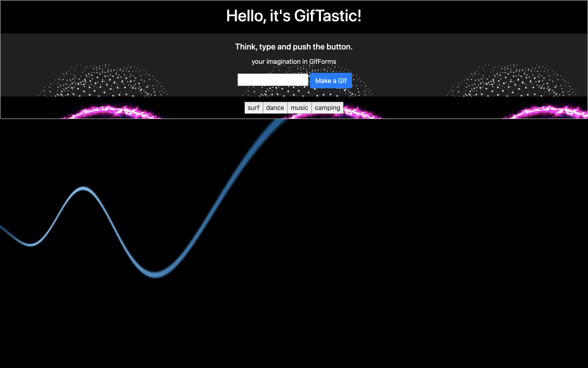

# GifTastic
##### Think, type and push button. Is that simple to make a animated gif.

##### Technologies used for this project
* html 5
* css 3
* JavaScript
* Jquery
---
* Game screen shot

---
## The following piece of code uses on.click method to identify the the answer given by the user.
```javascript
 var results = response.data

  for (i =0; i < results.length; i++) {
    
  // create a variable and takes a div
  var gifDiv = $("<div>");

  // create a variable p takes a p tag with rating result
  var p = $("<p>").text("Rating:" + results[i].rating);

  // create variable that takes a image tag 
  var gifImage = $("");

  // give attr and classes to gifImage variable
  gifImage.attr("src", results[i].images.fixed_height_still.url);
  gifImage.attr("data-still", results[i].images.fixed_height_still.url);
  gifImage.attr("data-animate", results[i].images.fixed_height.url);
  gifImage.attr("data-state", "still");
  gifImage.addClass("gifState");

  // append variable p to gifDiv
  gifDiv.append(p);
    
  // append new gifImage to gifDiv
  gifDiv.append(gifImage);

  // add gifDiv to gif area
  $("#gifs-appear-here").prepend(gifDiv);
  } 
  // function tha makes gif move and stop
  $(".gifState").on("click", function() {
      console.log("you clicked a gif");
      var state = $(this).attr("data-state");
      console.log(this);
      if (state === "still") {
        var animate = $(this).attr("data-animate");
        $(this).attr("src", animate);
        $(this).attr("data-state", "animate");
      } else {
        $(this).attr("src", $(this).attr("data-still"));
        $(this).attr("data-state", "still");
      }
    });
```
---
> Author
 Alexei Dias
 Linkedin 
 https://www.linkedin.com/in/alexei-dias-b4054a164/


